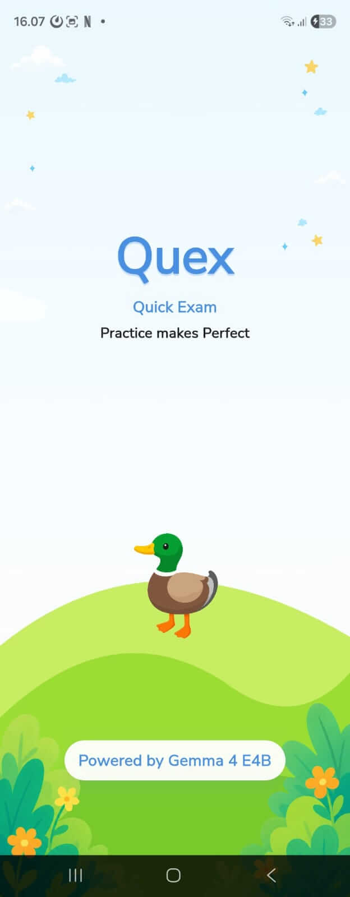
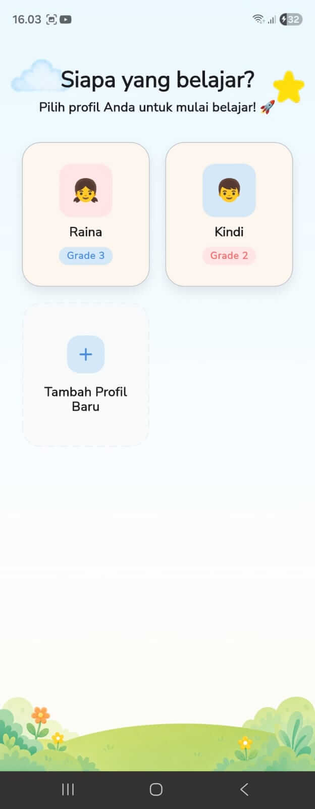
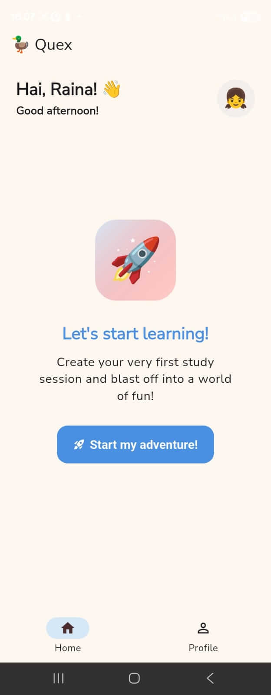
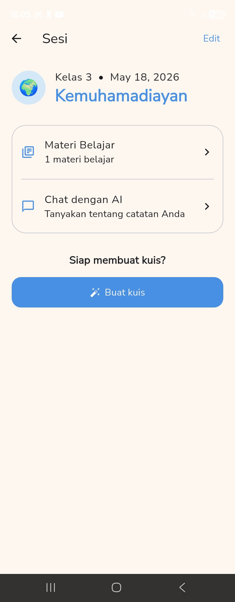
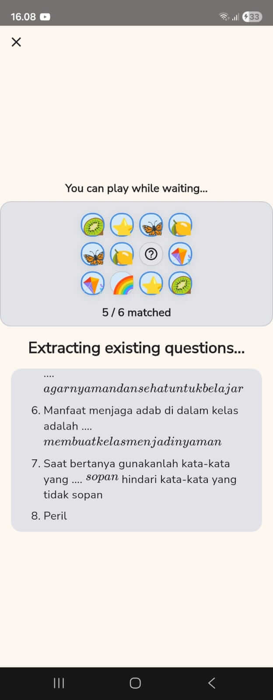
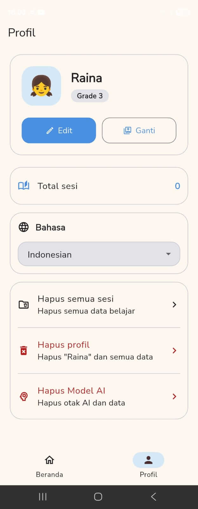
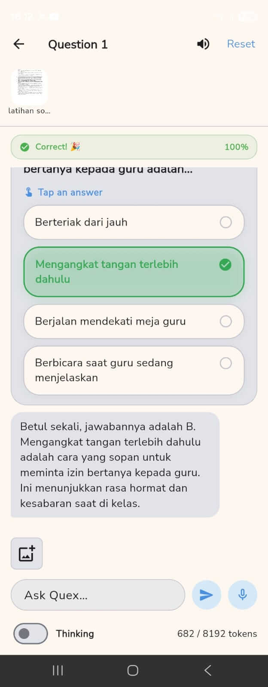
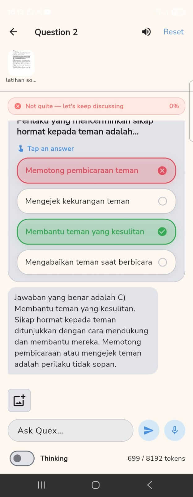
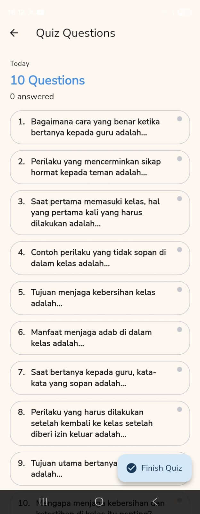

# Quex: Offline Worksheet-to-Practice Help for Kids

## 🌍 Problem

In many Indonesian homes, the bottleneck in learning is not curiosity. It is timely help.

A child has a worksheet, textbook page, or notes in front of them. The parent wants to help, but may be working, tired, or unable to explain the topic at that moment. The internet may also be unreliable or expensive, and cloud tutoring is a poor fit when the material is a private photo from a child’s schoolwork.

Two numbers make this concrete:

- **28%** of Indonesian students had problems at least once a week finding someone who could help them with schoolwork during remote learning. Source: [OECD PISA 2022 Indonesia country note](https://www.oecd.org/en/publications/pisa-2022-results-volume-i-and-ii-country-notes_ed6fbcc5-en/indonesia_c2e1ae0e-en.html).
- **53.8%** of surveyed Indonesian parents cited work demands as the main reason they could not accompany children studying at home. Source: [Konde / The Conversation Indonesia survey coverage](https://www.konde.co/2020/09/survey-beban-pendampingan-belajar-anak/).

Quex focuses on this narrow gap: **offline worksheet-to-practice help for kids at home.**

## 👨‍👩‍👧 Who It Helps

Quex is for Indonesian elementary families:

- Children who study from paper worksheets, textbook pages, or handwritten notes.
- Parents who cannot always sit beside the child during study time.
- Homes where privacy, connectivity, or shared devices make cloud AI fragile.

The product is intentionally not a general AI tutor. It is a quiet local study companion for the exact page the child already has.

## ✨ Product Loop

The core loop is simple:

1. A child or parent opens Quex.
2. They choose a child profile.
3. They create or open a study session.
4. They photograph or add the study material.
5. Quex generates quiz questions from that material.
6. The child answers.
7. If the answer is wrong, Quex explains the concept in simple language.
8. The child retries until the idea clicks.

That loop is the submission: photo → quiz → feedback → explanation → retry.

## 🎬 Demo Video

Demo: [Quex - AI Study companions for kids](https://www.youtube.com/watch?v=XkzYFKY4NgM)  
Duration: **2:50**

The video opens with the 28% OECD/PISA statistic, then shows the family study context, Quex running on a tablet, Gemma 4 E2B/E4B positioning, quiz practice, wrong/correct answer feedback, and parent-child interaction.

Because some UI details are hard to read in motion, the README and media gallery should include static screenshots from `docs/screenshot/`.

## 📱 APK Demo

APK: [Quex Android prototype](https://drive.google.com/file/d/1FwWAoeTvO0FAUn7hI_Ax-rMta77uOAi0/view?usp=drive_link)

Judge notes:

- The APK is a functional prototype.
- First launch downloads a Gemma 4 LiteRT-LM model.
- Gemma 4 E2B is about **2.58 GB**.
- Gemma 4 E4B is about **3.65 GB**.
- After the model is downloaded, the core study loop is designed to run locally and offline.

## 🖼️ Screenshots

Static screenshots are included so judges can inspect the app UI without relying only on the moving video.

| | | |
|---|---|---|
|  |  |  |
|  |  |  |
|  |  |  |

## 🧠 Why Gemma 4

Gemma 4 is central to Quex, not an interchangeable chatbot layer.

- **Multimodal understanding:** children can photograph real pages instead of typing them into a prompt.
- **Edge deployment:** E2B and E4B make a mobile-first tutoring workflow feasible.
- **Local inference:** private school materials do not need to be sent to a cloud LLM API.
- **Persistent tutoring:** the app keeps context across study turns instead of asking one-off questions.
- **Structured quiz behavior:** Quex asks Gemma 4 to produce quiz drafts, then validates and stores usable questions.

This makes Quex a strong fit for **Future of Education** and **LiteRT / AI Edge** judging.

## 🏗️ Technical Architecture

Quex is a Flutter app built around on-device inference and local persistence.

### AI layer

- `flutter_gemma` runs Gemma 4 locally.
- `ModelManager` selects Gemma 4 E2B or E4B based on device memory.
- Models are downloaded in LiteRT-LM format from Hugging Face.
- `GemmaChatService` wraps model initialization, sessions, streaming responses, image input, audio support, thinking streams, and function-call handling.
- Quiz generation uses a staged workflow: extraction, review, generation, validation.
- Tutor sessions are persistent, so the child can ask follow-up questions.

### Storage layer

- SQLite stores profiles, study sessions, materials, quizzes, questions, question messages, and chat messages.
- SharedPreferences stores lightweight app state such as active profile and model readiness.
- The app keeps study history on device.

### Product layer

- Profile selection supports multiple kids.
- Material upload supports text, images, and files.
- Quiz generation turns the child’s source material into practice.
- Tutor chat explains mistakes in short, child-friendly language.
- The UI is localized for Indonesian and English.

## 📊 Proof Points

Current verified proof from the repository:

- On-device Gemma 4 E2B/E4B model selection.
- LiteRT-LM model integration through `flutter_gemma`.
- Local SQLite persistence.
- Multimodal material preparation for text and image material.
- Persistent tutoring and coaching sessions.
- Defensive quiz parsing and validation before storing generated questions.
- Public video and APK artifacts.

Metrics to add before final Kaggle submission if available:

- Device tested.
- Selected model variant.
- First model load time.
- Photo-to-quiz time.
- Help-to-explanation time.
- Offline behavior after model download.

## 🔒 Offline & Privacy

Quex is local-first:

- The child’s worksheet photo is used by the on-device model path.
- Study history stays in local SQLite.
- The core tutoring experience does not depend on a hosted LLM API after setup.
- Offline use is realistic once the model is downloaded.

This matters for families with weak connectivity and for parents who do not want a child’s school material sent to a remote model by default.

## ⚠️ Limitations and Gemma 4 Feedback

Quex is a prototype, and the current Gemma 4 mobile stack still has rough edges:

- First-run setup requires a large model download.
- LiteRT-LM currently does not expose a visual token budget setting, which makes dense worksheet photos harder to tune.
- `flutter_gemma` still needs a cleaner multi-image upload path. This project has already contributed to [DenisovAV/flutter_gemma#262](https://github.com/DenisovAV/flutter_gemma/pull/262).
- Thinking mode is useful but still hard to steer consistently for short child-friendly tutoring.
- Tool calling can become unreliable in long-context sessions and may corrupt the output stream.

These are not blockers for the submission, but they are important implementation learnings.

## 🚀 Future Work

- Add better OCR and page segmentation for dense worksheets.
- Add parent-facing progress summaries.
- Add teacher-provided quiz templates.
- Improve offline model setup and preflight storage checks.
- Add more robust multimodal batching for multi-page materials.

## ✅ Closing

Quex is not trying to replace teachers or parents. It helps during the ordinary moment when a child is stuck, the material is already on the page, and help is not immediately available.

The submission should leave judges with three clear ideas:

1. The problem is real.
2. The app works as a focused local prototype.
3. Gemma 4 is a credible fit for worksheet-to-practice learning on the edge.
